# 🏗️ Data Warehouse Pipeline: Bronze → Silver → Gold

<div align="center">


**A modern three-layer data warehouse architecture for enterprise data integration and analytics**

</div>

---

## 📋 Table of Contents

- [Overview](#-overview)
- [Architecture](#-architecture)
- [Data Flow](#-data-flow)
- [Layer Structure](#-layer-structure)
- [Project Structure](#-project-structure)
- [Data Model](#-data-model)
- [Getting Started](#-getting-started)
- [Author](#-author)

---

## 🎯 Overview

This project implements a **medallion architecture** data warehouse pipeline that ingests raw CSV data from two source systems (**CRM** and **ERP**), processes it through three transformation layers, and produces business-ready analytical models.

### 📊 Source Systems

The pipeline integrates data from:

- **CRM System**: Customer relationship management data (3 CSV files)
- **ERP System**: Enterprise resource planning data (3 CSV files)

All source files are stored in the `database/` directory:

```
database/
├── crm/
│   ├── cust_info.csv
│   ├── prd_info.csv
│   └── sales_details.csv
└── erp/
    ├── CUST_AZ12.csv
    ├── LOC_A101.csv
    └── PX_CAT_G1V2.csv
```

---

## 🏛️ Architecture

The data warehouse follows a **three-layer medallion architecture** pattern, ensuring data quality and traceability at each stage.

```mermaid
graph LR
    A[📁 CRM CSV Files] -->|Bulk Insert| B[🥉 Bronze Layer]
    C[📁 ERP CSV Files] -->|Bulk Insert| B
    B -->|Clean & Transform| D[🥈 Silver Layer]
    D -->|Business Model| E[🥇 Gold Layer]
    E -->|Analytics| F[📊 BI & Reports]
    
    style B fill:#cd7f32,stroke:#8b4513,stroke-width:3px,color:#fff
    style D fill:#c0c0c0,stroke:#708090,stroke-width:3px,color:#000
    style E fill:#ffd700,stroke:#daa520,stroke-width:3px,color:#000
```

<div align="center">


</div>



---

## 🔄 Data Flow

The ETL pipeline processes data through three distinct stages, each with specific responsibilities.

<div align="center">


</div>

### Pipeline Stages

```mermaid
sequenceDiagram
    participant CSV as CSV Files
    participant Bronze as Bronze Layer
    participant Silver as Silver Layer
    participant Gold as Gold Layer
    
    CSV->>Bronze: 1. Bulk Insert (Raw Data)
    Note over Bronze: Truncate & Load<br/>No Transformation
    
    Bronze->>Silver: 2. ETL Process
    Note over Silver: • Data Cleaning<br/>• Standardization<br/>• Normalization<br/>• Enrichment
    
    Silver->>Gold: 3. Business Model
    Note over Gold: • Dimension Tables<br/>• Fact Tables<br/>• Star Schema
```



---

## 📂 Layer Structure

### 🥉 Bronze Layer

**Folder**: `bronze/`

The Bronze layer is the **raw data landing zone** where data is ingested from CSV files without any transformation.

**Key Characteristics**:
- ✅ Table structures mirror source CSV schemas
- ✅ Stored procedure: `bronze.load_bronze`
- ✅ Uses **BULK INSERT** with **Truncate & Insert** pattern
- ❌ No data cleaning or transformation
- 📌 Purpose: Data preservation and auditing

**Tables**:
- `bronze.crm_cust_info`
- `bronze.crm_prd_info`
- `bronze.crm_sales_details`
- `bronze.erp_cust_az12`
- `bronze.erp_loc_a101`
- `bronze.erp_px_cat_g1v2`

**Example Load Process**:
```sql
-- Execute Bronze layer load
EXEC bronze.load_bronze;

-- Bulk insert with truncate pattern
TRUNCATE TABLE bronze.crm_cust_info;
BULK INSERT bronze.crm_cust_info
FROM 'path/to/cust_info.csv'
WITH (
    FIRSTROW = 2,
    FIELDTERMINATOR = ',',
    TABLOCK
);
```

---

### 🥈 Silver Layer

**Folder**: `silver/`

The Silver layer transforms raw data into **clean, standardized, business-ready** datasets.

**Key Characteristics**:
- ✅ Stored procedure: `silver.load_silver`
- ✅ **Truncate & Insert** pattern for idempotency
- ✅ Comprehensive data quality transformations

**Transformation Operations**:

| Operation | Description | Example |
|-----------|-------------|---------|
| 🧹 **Cleaning** | Remove whitespace, fix nulls | `TRIM(cst_firstname)` |
| 📊 **Standardization** | Normalize codes to readable values | `'M' → 'Married'`, `'F' → 'Female'` |
| 🔢 **Normalization** | Convert data types, formats | `INT dates → DATE format` |
| ➕ **Derived Columns** | Calculate new fields | `prd_end_dt = LEAD(prd_start_dt) - 1` |
| 🔍 **Data Enrichment** | Extract category IDs, merge prefixes | `SUBSTRING(prd_key, 1, 5) AS cat_id` |
| ✔️ **Data Correction** | Fix invalid calculations | `sls_sales = sls_quantity * sls_price` |

**Tables**:
- `silver.crm_cust_info` - Cleaned customer information
- `silver.crm_prd_info` - Standardized product data with derived dates
- `silver.crm_sales_details` - Corrected sales transactions
- `silver.erp_cust_az12` - Normalized customer demographics
- `silver.erp_loc_a101` - Standardized location data
- `silver.erp_px_cat_g1v2` - Product categories and attributes

**Example Transformation**:
```sql
-- Standardize gender values
CASE 
    WHEN UPPER(TRIM(cst_gndr)) = 'F' THEN 'Female'
    WHEN UPPER(TRIM(cst_gndr)) = 'M' THEN 'Male'
    ELSE 'n/a'
END AS cst_gndr

-- Fix sales calculations
CASE 
    WHEN sls_sales != sls_quantity * sls_price 
        THEN sls_quantity * sls_price
    ELSE sls_sales
END AS sls_sales
```

---

### 🥇 Gold Layer

**Folder**: `gold/`

The Gold layer implements a **star schema** with dimension and fact tables optimized for analytics.

<div align="center">


</div>

**Business Views**:

#### 📐 1. Product Dimension (`gold.dim_products`)

Merges product information with category attributes:
- **Source tables**: `silver.crm_prd_info` + `silver.erp_px_cat_g1v2`
- **Key fields**: product_key (surrogate), product_id, product_number, product_name, category, subcategory, cost, product_line

```sql
CREATE VIEW gold.dim_products AS
SELECT
    ROW_NUMBER() OVER (ORDER BY pn.prd_start_dt, pn.prd_key) AS product_key,
    pn.prd_id AS product_id,
    pn.prd_key AS product_number,
    pc.cat AS category,
    pc.subcat AS subcategory,
    pn.prd_cost AS cost
FROM silver.crm_prd_info pn
LEFT JOIN silver.erp_px_cat_g1v2 pc
    ON pn.cat_id = pc.id
WHERE pn.prd_end_dt IS NULL; -- Active products only
```

#### 👥 2. Customer Dimension (`gold.dim_customers`)

Comprehensive customer profile from multiple sources:
- **Source tables**: `silver.crm_cust_info` + `silver.erp_cust_az12` + `silver.erp_loc_a101`
- **Key fields**: customer_key (surrogate), customer_id, first_name, last_name, country, marital_status, gender, birthdate

```sql
CREATE VIEW gold.dim_customers AS
SELECT
    ROW_NUMBER() OVER (ORDER BY cst_id) AS customer_key,
    ci.cst_id AS customer_id,
    ci.cst_firstname AS first_name,
    ci.cst_lastname AS last_name,
    la.cntry AS country,
    ci.cst_marital_status AS marital_status,
    COALESCE(ci.cst_gndr, ca.gen, 'n/a') AS gender,
    ca.bdate AS birthdate
FROM silver.crm_cust_info ci
LEFT JOIN silver.erp_cust_az12 ca ON ci.cst_key = ca.cid
LEFT JOIN silver.erp_loc_a101 la ON ci.cst_key = la.cid;
```

#### 💰 3. Sales Fact Table (`gold.fact_sales`)

Transaction-level sales data with foreign keys to dimensions:
- **Source table**: `silver.crm_sales_details`
- **Key fields**: order_number, product_key (FK), customer_key (FK), order_date, sales_amount, quantity, price

```sql
CREATE VIEW gold.fact_sales AS
SELECT
    sd.sls_ord_num AS order_number,
    pr.product_key,
    cu.customer_key,
    sd.sls_order_dt AS order_date,
    sd.sls_sales AS sales_amount,
    sd.sls_quantity AS quantity
FROM silver.crm_sales_details sd
LEFT JOIN gold.dim_products pr ON sd.sls_prd_key = pr.product_number
LEFT JOIN gold.dim_customers cu ON sd.sls_cust_id = cu.customer_id;
```

---

## 📊 Data Model

The Gold layer implements a **star schema** for optimal analytical performance.

<div align="center">


</div>


---

## 📁 Project Structure

```
SQL_Datawarehouse_project/
│
├── 📂 database/                    # Source CSV files
│   ├── crm/                        # CRM system data
│   │   ├── cust_info.csv
│   │   ├── prd_info.csv
│   │   └── sales_details.csv
│   └── erp/                        # ERP system data
│       ├── CUST_AZ12.csv
│       ├── LOC_A101.csv
│       └── PX_CAT_G1V2.csv
│
├── 📂 scripts/                     # SQL scripts
│   ├── init_database.sql           # Database & schema creation
│   │
│   ├── 📂 bronze/                  # Bronze layer scripts
│   │   ├── ddl_bronze.sql          # Table definitions
│   │   └── proc_load_bronze.sql    # ETL stored procedure
│   │
│   ├── 📂 silver/                  # Silver layer scripts
│   │   ├── ddl_silver.sql          # Table definitions
│   │   └── proc_load_silver.sql    # ETL stored procedure
│   │
│   └── 📂 gold/                    # Gold layer scripts
│       └── ddl_gold.sql            # View definitions
│
├── 📂 docs/                        # Documentation
│   ├── data_catalog.md             # Gold layer data dictionary
│   └── naming_conventions.md       # Naming standards
│
├── 📂 tests/                       # Quality assurance
│   ├── quality_checks_silver.sql   # Silver layer validation
│   └── quality_checks_gold.sql     # Gold layer validation
│
├── 📄 README.md                    # This file
└── 📄 LICENSE                      # MIT License
```

---

## 🚀 Getting Started

### Prerequisites

- SQL Server 2016 or higher
- SQL Server Management Studio (SSMS) or Azure Data Studio
- File system access for BULK INSERT operations

### Installation Steps

1️⃣ **Initialize Database**
```sql
-- Create database and schemas (bronze, silver, gold)
EXECUTE script: scripts/init_database.sql
```

2️⃣ **Create Bronze Layer**
```sql
-- Create Bronze tables
EXECUTE script: scripts/bronze/ddl_bronze.sql

-- Create Bronze load procedure
EXECUTE script: scripts/bronze/proc_load_bronze.sql
```

3️⃣ **Create Silver Layer**
```sql
-- Create Silver tables
EXECUTE script: scripts/silver/ddl_silver.sql

-- Create Silver load procedure
EXECUTE script: scripts/silver/proc_load_silver.sql
```

4️⃣ **Create Gold Layer**
```sql
-- Create Gold views (dimensions & facts)
EXECUTE script: scripts/gold/ddl_gold.sql
```

### Running the Pipeline

Execute the ETL pipeline in sequence:

```sql
-- Step 1: Load raw data into Bronze
EXEC bronze.load_bronze;

-- Step 2: Transform and load Silver
EXEC silver.load_silver;

-- Step 3: Gold views are automatically available
SELECT * FROM gold.dim_customers;
SELECT * FROM gold.dim_products;
SELECT * FROM gold.fact_sales;
```

### Quality Validation

Run quality checks to ensure data integrity:

```sql
-- Validate Silver layer
EXECUTE script: tests/quality_checks_silver.sql

-- Validate Gold layer
EXECUTE script: tests/quality_checks_gold.sql
```

---

## 👨‍💻 Author

**Ahmed Mohsen**

[](https://www.linkedin.com/in/ahmed-el-tlawy-a81b8a200/)

---

<div align="center">

**📌 Built with SQL Server | 🏗️ Medallion Architecture | ⭐ Star Schema Design**

</div>
